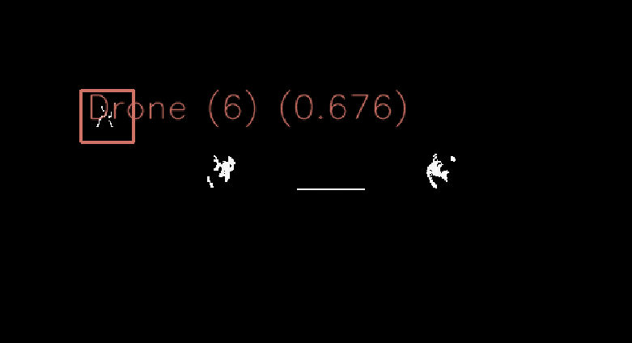
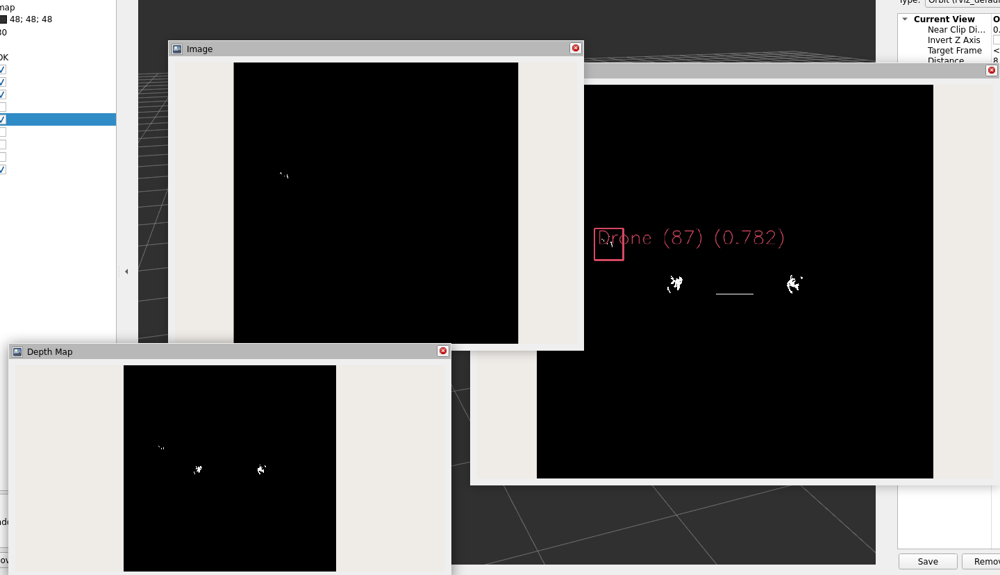
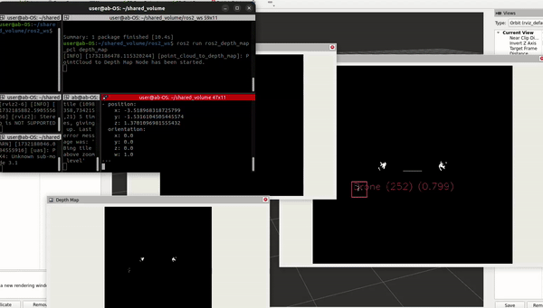

# ROS2 Depth Map Detection and Localization Package
Using PCL to Convert Point Cloud Data into a Depth Map for Object Detection and Localization

## Description

This ROS2 package provides a robust solution for converting point cloud data into depth maps, integrating advanced detection capabilities with YOLO to detect objects within the depth map. The package generates two types of depth maps: one representing the original scene and another highlighting the depths of detected objects. Additionally, it publishes pose data (x,y,z) for detected objects, aiding in accurate object localization in 3D space.

---

## Table of Contents
1. [Demonstration](#demonstration)
2. [Features](#features)
3. [Installation](#installation)
4. [Usage](#usage)
5. [Node](#node)
6. [Contributing](#contributing)

---
## Demonstration

### Depth Map Detection and Localizationin in Action


<p align="center">
</p>

<p align="center">
  
  
</p>

<p align="center">
  
</p>

---

## Features

- **Original Depth Map Generation**: Converts the lidar point clouds to depth maps representing the entire scene.
- **Object-specific Depth Map**: Isolates and enhances depth data specifically for detected objects, based on YOLOv8 outputs.
- **3D Position Estimation**: Calculates and publishes the average pose of detected objects based on depth data.
- **Detected Object Point Cloud Streaming**: Publishes the points within bounding boxes (BB) as distinct point clouds for each detected object.
- **Multi-Object Detection and Localization**: Simultaneously detects and estimates positions for multiple detected objects in real-time.
- **ROS2 Integration**: Fully compatible with ROS2 for seamless integration in robotics applications.
---

## Installation

### Prerequisites
- **ROS2 Humble**: Ensure you have ROS2 Humble installed on your machine. [Installation Guide](https://docs.ros.org/en/humble/Installation.html)
- **yolovX_ros**: Follow the instructions to set up YOLOvX in ROS2 for object detection. [Installation Guide](https://github.com/mgonzs13/yolov8_ros)
- **C++ compiler (GCC 8 or newer).**
- **PCL (Point Cloud Library), OpenCV, and other ROS2 dependencies.**

### Install Dependencies:
Install the necessary dependencies using the following command:
```bash
sudo apt-get update
sudo apt-get install libpcl-dev libopencv-dev
```
### Clone the Repository
```bash
cd ~/ros2_ws/src
git clone https://github.com/AbdullahGM1/ros2_depth_map_detection_localization_cpp.git
```
### Build the Package:
Navigate back to your ROS2 workspace root and use ``colcon`` to build the package:
```bash
cd ~/ros2_ws
colcon build --packages-select ros2_depth_map_detection_localization_cpp
```
### Source the setup files:
To make the ROS2 package available in your environment, source the setup file::
```bash
source install/setup.bash
```
---

## Usage

### Modifying the the Launch File
Before running the package, make sure to modify the `launch` files located in the `ros2_lidar_camera_fusion_with_detection_cpp/launch` directory to match your setup:

1. **Set the min and max values**: Set the `Minimum` and `Maximum` values of the depth range for the Lidar point cloud. The depth is in `x-axis`.
   Example:
```python
parameters=[
    {'min_depth': 0.2, 'max_depth': 10.0, # Setup your min and max depth range, where (x-axis) is the depth
```
2. **Set the source and target frames**: Set the `source` frame and the `target` frame of the sensors to get the transformation matrix between these two frames. In this case, the `source` frame is the `lidar` and the `target` is the `camera` frame. 
   Example:
```python
'lidar_frame': 'source/frame/name',  # Default source frame
'camera_frame': 'target/frame/name'}  # Default target frame
```
3. **Set the Topic Names**: Set the `topics` names that the node needs to do the lidar/camera fusion. 
   Example:
```python
],
remappings=[
# Replace with actual topic names
            ('/scan/points', '/lidar/topic/name'), # The lidar point cloud topic
            ('/interceptor/gimbal_camera_info', '/camerainfo/topic/name'),# The camera info topic
            ('/interceptor/gimbal_camera', '/camera/topic/name'), # The camera image topic 
            ('/yolo/tracking', '/yolo/tracking/topic/name') # The YOLO BB tracking topic
        ]
```
4. **Set the Yolo Parameters**: Set the `yolo_ros` package arguments for the `model`, `input_image_topic`, and `threshold`. 
   Example:
```python
        launch_arguments={
            'model': '/home/user/shared_volume/ros2_ws/src/d2dtracker_drone_detector/config/yolo11s.pt',
            'threshold': '0.5',
            'input_image_topic': '/interceptor/gimbal_camera',
            'device': 'cuda:0'
        }.items()
```
### Build the Package
After modifying the `launch` file, build your package:
```bash
cd ~/ros2_ws
colcon build --packages-select ros2_lidar_camera_fusion_with_detection_cpp
```
### Source the Workspace
Before running the package, ensure you source the workspace to have access to the built packages:

For **Bash**:
```bash
source ~/ros2_ws/install/setup.bash
```

### Run the Node
To run the package:
```bash
ros2 launch ros2_lidar_camera_fusion_with_detection_cpp lidar_camera_fusion.launch.py
```
Or 

```bash
ros2 launch ros2_lidar_camera_fusion_with_detection_cpp lidar_camera_fusion_yolo.launch.py
```

---
## Node

### `lidar_camera_fusion_node`

This node fuses lidar point cloud data onto the camera image frame and overlays the points within detected object bounding boxes onto the image. Also, publishing the points within the bounding box as point cloud points.

#### Subscribed Topics:

-**`/scan/points`**: Lidar point cloud data.

-**`/interceptor/gimbal_camera`**: Camera image output.

-**`/interceptor/gimbal_camera_info`**: Camera info for the Camera Intrinsic.

-**`/yolo/tracking`**: Detected objects with bounding boxes.


#### Published Topics:

-**`/image_lidar`**: Image with projected Lidar points.

-**`/detected_object_distance`**: Average distance from the detected objects to the camera frame.

-**`/detected_object_pointcloud`**: Points inside the bounding boxes are published as point cloud points.

---
## Contributing

Feel free to contribute to this project by creating pull requests or opening issues.
